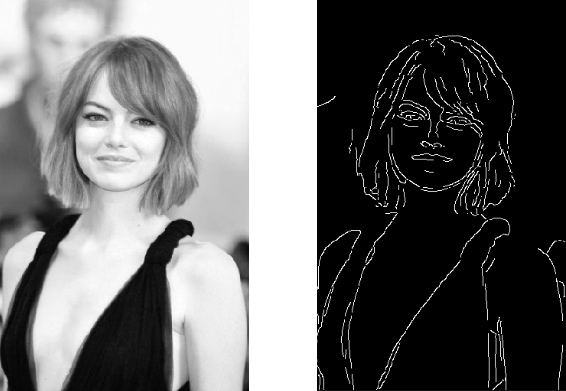
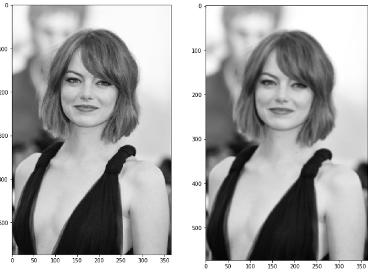
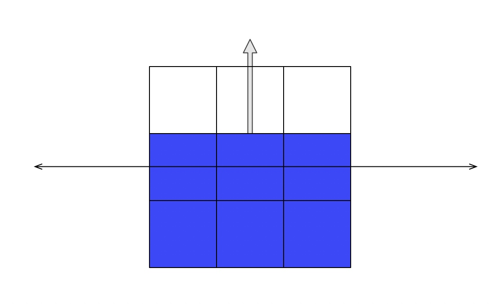
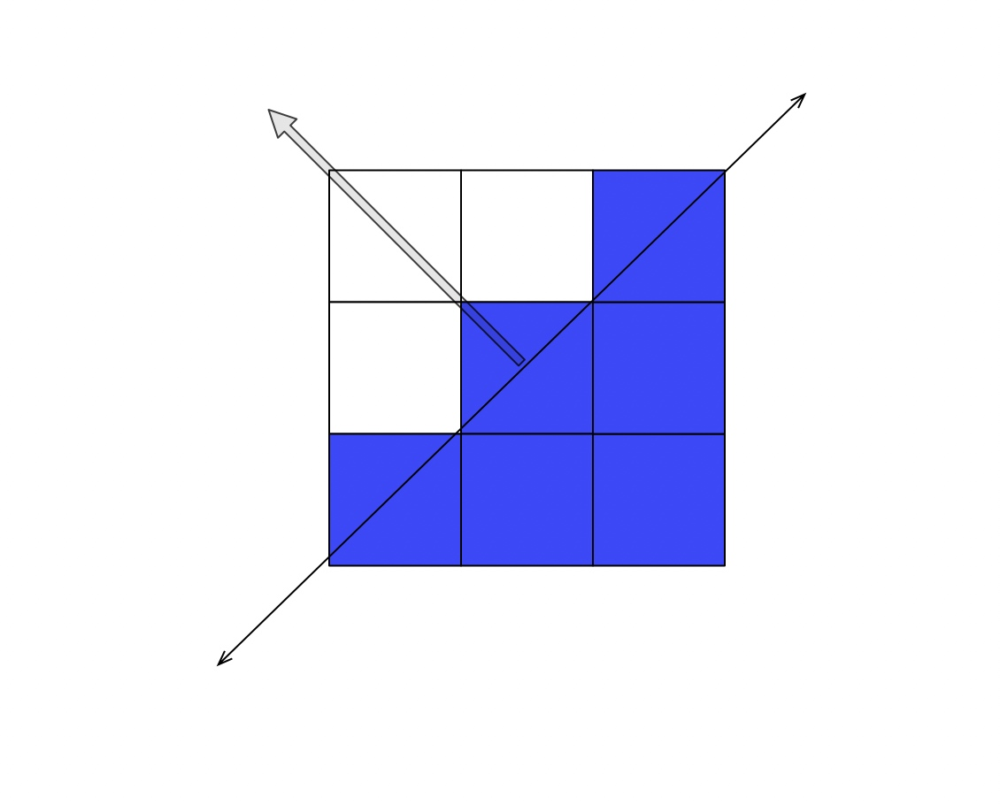
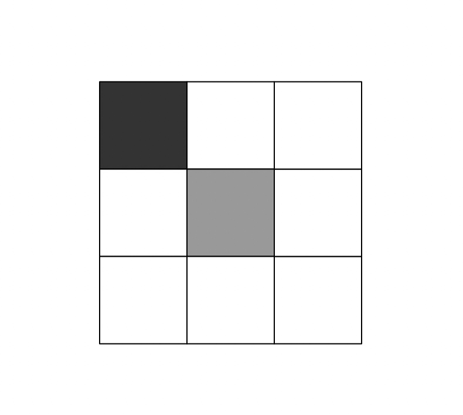
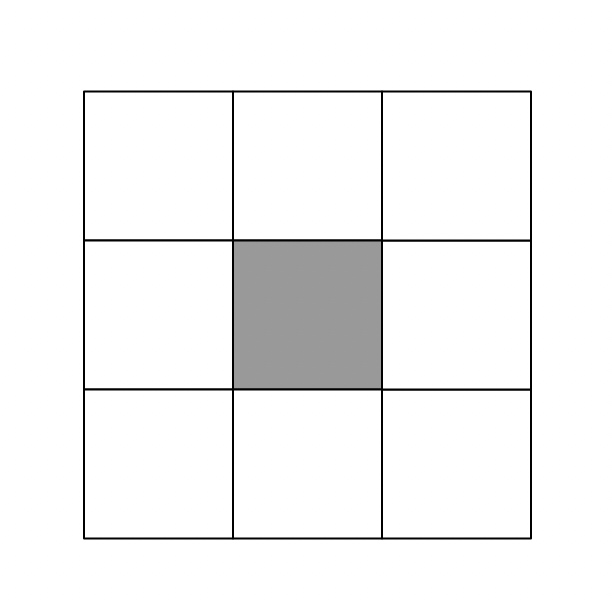

# Canny Edge边缘检测算法

Canny Edge算法是一种用于检测图片中轮廓边缘的算法，其特点是能够生成非常细致的边缘轮廓线，在图片识别领域具有广泛的应用性。先放两张图感受一下效果：




## 算法步骤
Canny Edge一般分为五步：
1. 去噪。
2. 对灰度变化求导。
3. 非最值抑制。
4. 双阈值过滤。
5. 边缘追踪。

下面我们来逐步了解一下Canny Edge这个算法。

### 1. 去噪
由于Canny Edge算法利用灰度变化值来分析边缘，一旦有噪点存在就会极大地干扰灰度变化导数，产生很多额外的无效边缘，所以要先将噪点过滤掉。
去噪有多种方法，瀑布式去噪点、中值滤波、高斯滤波等，这里我们选用最常见的高斯滤波法来进行去噪。经过高斯滤波后的图片会变得稍微模糊一些，但是图像上的噪点会大大减少。



### 2. 计算灰度图梯度
经过去噪之后，我们就可以进行灰度的梯度计算了。为了计算方便，我们只想要得到水平方向和垂直方向灰度的变化梯度，这可以通过用Sobel算子来完成。
Sobel算子的水平方向滤波矩阵和垂直方向滤波矩阵：
```python
K_x = [
    [-1, 0, 1],
    [-2, 0, 2],
    [-1, 0, 1],
]
K_y = [
    [1, 2, 1],
    [0, 0, 0],
    [-1, -2, -1],
]
```
我们将原图的灰度值矩阵表示为$M_g$，将两个滤波器应用于灰度值矩阵后得到水平方向的变化梯度$I_x$和垂直方向的变化梯度$I_y$。接下来我们要计算各个点上的变化梯度绝对值和梯度变化的方向：
$|G|=\sqrt{I_x^2+I_y^2}$
$\theta(x,y)=arctan(\frac{I_x}{I_y})$
完成了这一步，我们已经知道的各个点的变化梯度大小和变化的方向，我们可以认为在各个点上梯度变化的切线方向就是边缘线，因为灰度变化最快的方向于图像的边缘是垂直的（垂直于边缘线前进时灰度会剧烈变化，沿着边缘线前进时图像灰度基本不变）
关于边缘和灰度梯度的垂直关系用以下的例子来详细说明：

比如这样的九个像素点，最上一排的三个像素点是白色，其他为蓝色，那么对于中间的这个点，其灰度梯度的方向应该是粗箭头所指的方向，很明显，在这里的边缘应该是水平的细箭头的方向，也就是垂直于灰度梯度的方向。

对于倾斜的边缘例子也是一样，如上图，灰度梯度是45度向左上，边缘应当是45度右上到左下，也是垂直的关系。

###3. 非极值抑制
在完成了上一步之后，我们发现检测到了大量的重叠的边缘线，叠在一起构成了比较粗的边缘线，为了得到更为细致准确的边缘线，我们要对叠加在一起的（其实是彼此相邻）的边缘线进行非极值抑制过滤。
其实这一步的算法很简单，我们首先对每一个点查看其边缘方向，并查看其边缘垂直方向上相邻两个点的梯度值，如果当前点比相邻两个点的梯度值都大，则将该点梯度保留，否则将该点梯度置为0。

###4. 双阈值过滤
现在我们拥有了梯度大小不一的点组成的一系列细边缘，接下来要对这些边缘点进行一步过滤，按照其梯度大小将其分为三种：
1. 梯度值很大，一定是边缘的点，我们设定一个高阈值，只有高于高阈值的才是这类边缘点。
2. 梯度值很小，一定不是边缘的点，我们设定一个低阈值，只有低于低阈值的才是这类边缘点。
3. 梯度值中游，说不好是不是边缘的点，也即在两个阈值之间的点。

我们将第二类点滤除，第一类点和第三类点分组记录下来，以便下一步继续处理。

###5. 边缘追踪
在这一步里，我们需要处理梯度值在高低阈值之间的点，将他们进一步分类为是边缘的点和不是边缘的点。这里的算法也很简单，对于每一个点，查看其相邻的八个像素点，如果有任意一个是已经确认的边缘点，则将其确认为边缘点。

对于上图中间的点（灰色代表处于高低阈值中间，黑色代表确认的边缘点，白色代表不是边缘点），由于其周围8格有确认的边缘点，因此将其认作边缘点。

而这个点，其周围八格都没有确认的边缘点，因此将其认作非边缘点。

最后，我们将所有的确认的边缘点返回，就得到了检测到的边缘线。

## 参考文献
> https://towardsdatascience.com/canny-edge-detection-step-by-step-in-python-computer-vision-b49c3a2d8123