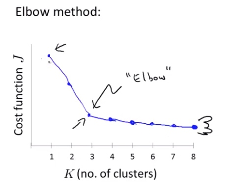
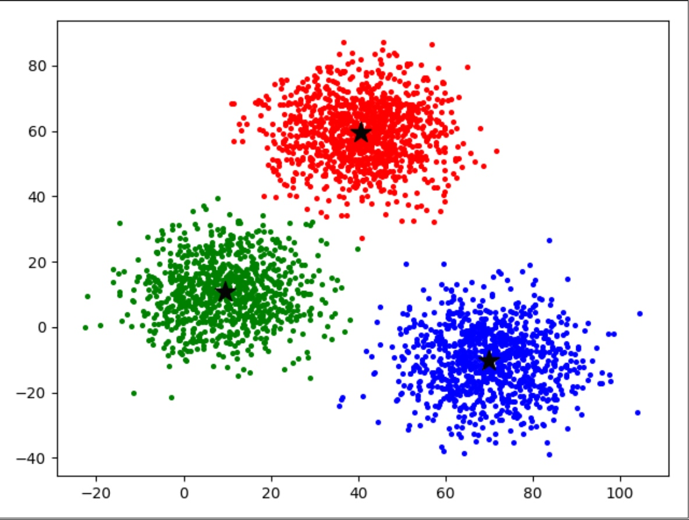

# 机器学习算法：K均值聚类 (Kmeans)

K均值聚类是一种用于寻找数据结构和分类的非监督学习算法。
<!-- more -->

## 算法步骤

首先要进行初始化，如果要分K类的话，要找出K个起始的类中心点,标记为$\mu_1 ... \mu_k$。
接下来将每个点按照到各个类中心点的距离，将其分配到最近的那个类中心点所代表的类中。我们用$c^{(i)}$来代表$x^{(i)}$所在的类的编号。
之后将每个类中心点的位置变动到类中所有点的中心位置上。
用伪代码表示：
```
随机分配K个类中心
重复直到没有变动 {
    # 分配点到各个类中
    for i in range(m):
        c[i] = 距离x[i]最近的类中心的编号
    # 变动中心点
    for k in range(k):
        miu[k] = mean([point for point in x if point[i] == k])
```

## 损失函数
我们用$\mu_c^{(i)}$来表示$x^{(i)}$被分配到的聚类编号。
则代价函数为$J(c^{(i)}...c^{(m)},\mu_1...\mu_k)=\frac{1}{m}\sum_{i=1}{m}||x^{(i)}-\mu_c{(i)}||^2$，也就是求所有点到所在类的类中心的距离平方和。
所以在算法步骤中，分配点到各个类其实就是在保持$\mu$不变，改变$c_i$来减少J，变动中心点就是保持$c_i$不变，改变$\mu$来减少J，当最后两者都不能变时，就达成了最优（但是这个最优可能是局部最优）。

## 复杂度
每一次迭代计算每个点所在组的复杂度：O(KN)
每一次迭代结束重新计算每个组中心点的复杂度：O(K)

## 优化
### 随机初始化
初始化类中心点一般是选取任意k个训练数据点（k<m），将他们设为类中心。
根据不同的初始化点，最后的聚类优化结果很可能会不同，聚类可能会被困在局部最优，因此一般会进行50到1000次随机初始化然后进行聚类优化，最后选取代价函数J最小的那个，认为是达成了全局最优。

### 选取合适的聚类数量k
1. 使用肘部方法：将J与对应的聚类数目k进行绘图，得到的会是如下图所示的一个图像，（随着k的增加，J是一定会减少的，除非被卡在局部最优）。然后选择曲线拐点处对应的k，也即选择曲线的“肘部”对应的k为聚类数。


2. 根据聚类得到的分类将用于何种用途来人为地决定。

## 应用
1. 图片的有损压缩


2. 用户分类

