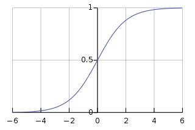

# 机器学习算法：逻辑回归

逻辑回归的基本形式和线性回归差不多，属于监督性学习，但是逻辑回归一般是用来处理分类问题的。
<!-- more -->
## 1. 问题场景
我们现在收集到了一个班级里学生的智商、每日学习时间以及高考是否考上了一本的数据。假设一共有50个学生，也即我们有50组数据，现在想根据这组数据来预测其他已知智商、每日学习时间的学生高考是否能上一本。

### 1.1. 预测函数 hypothesis function
由于这里是一个分类问题，y应该只有两个可能的值，要么该学生能上一本，我们取1，要么上不了，我们取2。
在这里我们使用sigmoid函数，也叫做逻辑函数来对入参$\theta^TX$进行处理，使y的值归于0到1之间，逻辑函数的图像如下：

> sigmoid函数的特殊性：
> 对于sigmoid函数$g(z) = \frac{1}{1+e^{-z}}$，当z为正无穷时，g(z)=0，当z为负无穷时，g(z)=1，g(z)的值永远在0到1之间，且z=0时g(z)=0.5，g(z)的值可以非常方便地用来做二元分类的分类可信度使用。

预测函数如下：
$h_\theta(X) = g(\theta^TX)$
$g(z) = \frac{1}{1+e^{-z}}$
也即：
$h_\theta(X) = \frac{1}{1+e^{-\theta^TX}}$

## 1.2. 决策边界 decision boundary
决策边界即是分割分类中真假两部分的线。
由预测函数预测到的值可以视为学生上一本的概率，当其低于0.5时，我们预测该学生不能上一本，不低于0.5时我们预测其可以考上一本。
也即
$h_\theta(X) = g(\theta^TX) = P(y=1|X;\theta)$
$g(z) = \frac{1}{1+e^{-z}}$
当$z\ge0$时$g(z)\ge0.5$
可以得出当$\theta^TX\ge0$时我们预测可以考上一本，解出式子$theta^TX = 0$即为决策边界。

## 1.3. 损失函数 cost function
我们先定义$J(\theta)=\frac{1}{2m}cost(h_\theta(x^{(i)}, y^{(i)})$，其中
在线性回归中，我们对$cost(h_\theta(x^{(i)}, y^{(i)})$的定义为$$\frac{1}{2}((h_\theta(x^{(i)})^2 - (y^{(i)})^2)$，也就是预测值与实际值差的平方和。
如果在逻辑回归中依然这样定义的话，代价函数将会变成一个非凸函数，$J(\theta)$会拥有很多个局部最优解，这对梯度下降求解是很不利的。
因此我们将$cost(h_\theta(x^{(i)}, y^{(i)})$分情况定义：
在y=1时，$cost(h_\theta(x^{(i)}, y^{(i)}) = -log(h_\theta(x^{(i)})$，这样预测值为1时代价为0，预测值越靠近0代价越高；
在y=0时，$cost(h_\theta(x^{(i)}, y^{(i)}) = -log(1-h_\theta(x^{(i)})$，预测值为0时代价为0，预测值越靠近1代价越高。
将其用一个式子简化：
$cost(h_\theta(x), y) = -y \cdot log(h_\theta(x^{(i)}) - (1-y) \cdot log(1-h_\theta(x^{(i)})$
$J(\theta) = -\frac{1}{2m} \sum_{i=1}^m[y^{(i)}logh_\theta(x^{(i)})+(1-y^{(i)})log(1-h_\theta(x^{(i)})]$

**矩阵表示**
$J(\theta) = -\frac{1}{2m}(Y^Tlogh_\theta(X) + (1-Y)^T(1-logh_\theta(X)))$

## 2. 梯度下降进行优化
在收敛之前，重复以下操作：
$\theta_j = \theta_j - \frac{a}{m} (h_\theta(x^{(i)} - y^{(i)}) \cdot x_j^{(i)}$

**矩阵表示**
$\theta = \theta - \frac{a}{m} \cdot X^T \cdot (g(X\theta) - Y)$


## 3. 多个类型的分类
当需要预测多个类型的分类时，我们可以使用1 vs rest的分类方法。
假设我们要对学生的高考结果分为一本，二本，三本，大专和没考上五类，那么使用1 vs rest的方法，我们首先考虑一本的分类，即预测是否上了一本，再考虑二本的分类，一直到大专，也就是说如果要分成k类的话，我们需要构建k个预测函数:
$h^{(i)}_\theta(X) = P(y=i|X, \theta), i \in range(classes)$
对于一个新的输入X，我们预测它的输出是第i类，i为对应的预测函数值最大的那个（说明根据我们的模型，被分为第i类的概率最大:$max(h^{(i)}_\theta(X)), i \in range(classes)$

## 4. 代码实践
用sklearn中的逻辑回归api
```python
from sklearn import linear_model

X = [
    [20, 3],
    [23, 7],
    [31, 10],
    [42, 13],
    [50, 7],
    [60,5],
]

y = [0, 1, 1, 1, 0, 0]

lr = linear_model.LogisticRegression()  # 封装了逻辑回归的api接口
lr.fit(X, y)

testX = [[28, 8]]

label = lr.predict(testX)   # predict方法返回给定输入的预测结果
print("predicted label = ", label)

prob = lr.predict_proba(testX)  # predict_proba方法返回给定输入的预测概率
print("probability = ", prob)

theta_0 = lr.intercept_  # intercept_属性中存储第0个参数
theta = lr.coef_  # coef_中存储着所有的其他theta参数

>> predicted label =  [1]
>> probability =  [[0.14694811 0.85305189]]
```