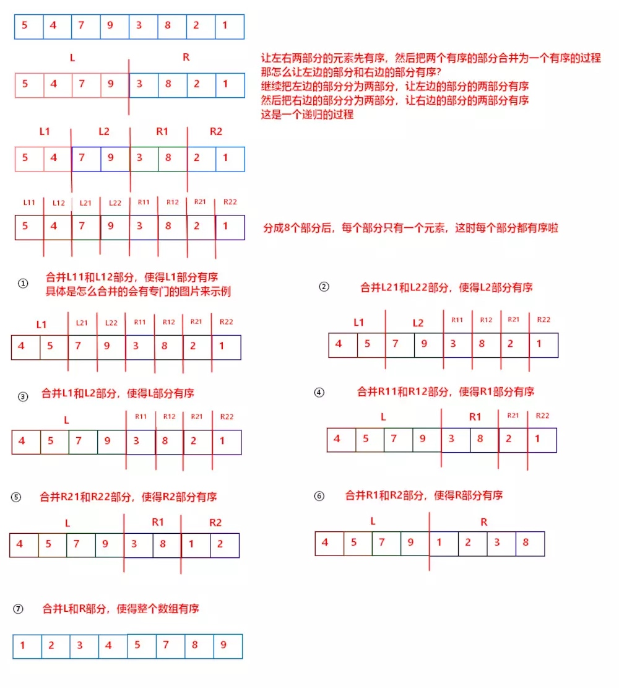
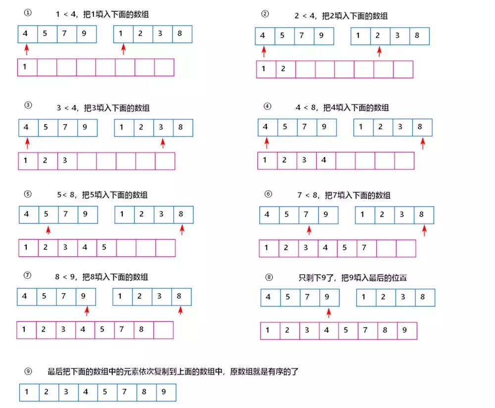

# 归并排序 Merge Sort

归并排序是一种经典的分治算法，它的基本思路是将整个数组分为子数组，再在保证子数组有序的基础上对子数组合并。
<!-- more -->

首先要做的是将数组分为子数组，怎么保证子数组有序呢？不停地将子数组拆分，直到所有子数组都只有一个元素就可以了，一个元素的子数组一定是有序的子数组，这个过程是递归下去的，时间复杂度为O(logN)。
接下来要将有序的子数组两两合并，因为这里两个子数组是有序的，因此合并的问题就变成了怎么将两个有序子数组合并成一个有序数组？答案非常简单，只要从两个有序子数组的头部开始，比较两者的头部，哪个小哪个就挪入新的数组，然后依次向后比较即可，时间复杂度为O(N)。
这样把两部分合并起来，先拆分，再合并，就对整个数组完成了排序，算法总时间复杂度为O(NlogN)

图示如下：（图片来自https://www.jianshu.com/p/33cffa1ce613）

参考资料：
[[图解] 归并排序](https://www.jianshu.com/p/33cffa1ce613)
